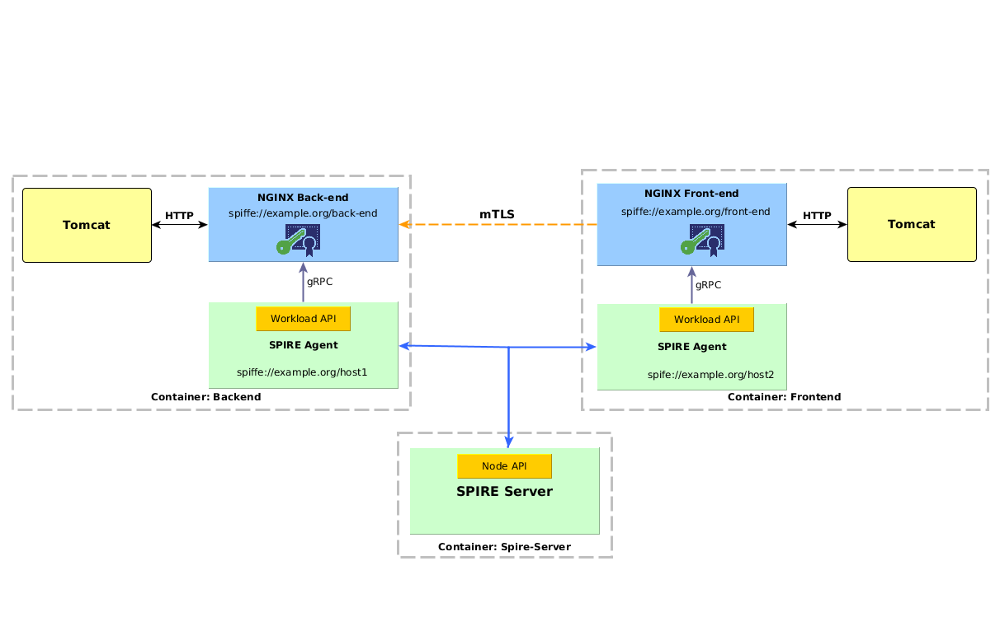

# Securing Java microservices with SPIFFE NGINX

This example shows two java applications running in Tomcat in separate Docker containers, proxied by SPIFFE NGINX, that
fetches and validates the X509-SVIDs.

The current example consists of the following modules:

_**back-end**_: simple Spring boot application with a RestController that handles GET requests. It's packaged in a WAR file 
and run on a standalone Tomcat.

_**front-end**_: simple Web-app that fetch data from the back-end. It's packaged in a WAR file and
run in standalone Tomcat.

_**[spiffe nginx](https://github.com/spiffe/spiffe-nginx)**_: a version of NGINX Open Source interacts with the SPIFFE Workload API to request and use certificates for mTLS.
                    
_**[spire](https://github.com/spiffe/spire)**_: agent and server, for issuing the SVIDs and attesting the workloads


## Demo scenario 

### Components

This demo is composed of 3 containers: one container with the SPIRE server and two containers running a Tomcat, a SPIFFE NGINX Proxy
and a Spire Agent. In the Tomcats run the java services _front-end_ and _back_end_




### Configurations

#### Tomcat

We will have a standalone Tomcat 8 running in the Backend and Frontend containers

In the **Backend** container, the `/opt/tomcat/conf/server.xml` has a connector on port 3000, over which 
it will get the HTTP GET requests. 

``` 
    <Connector port="3000" protocol="HTTP/1.1"
               connectionTimeout="20000"
               redirectPort="8443" />
``` 

In the **Frontend** container, Tomcat will have a connector for listening for HTTP requests on port 4001, this
is the port to access the web-app from the browser:

``` 
    <Connector port="4001" protocol="HTTP/1.1"
               connectionTimeout="20000"
               redirectPort="8443" />
``` 

The Frontend will run with a URL property for fetching data from the backend, in this case that URL will be
where the NGINX Proxy is listening: `http://localhost:80`

The script for running the Frontend Tomcat: 

```
export JAVA_OPTS="$JAVA_OPTS -Dtasks.service=http://localhost:80/tasks/"
/opt/tomcat/bin/catalina.sh run
```

#### SPIFFE NGINX

The NGINX Proxy in the **Backend** container will have the following configuration: 

```
daemon off;
user backend;
pid /home/nginx.pid;
worker_processes 1;
error_log /dev/stdout debug;
events {
  worker_connections 1024;
}

http {
  upstream tomcat {
    server 127.0.0.1:3000;
  }
  server {
    listen       8443 ssl;
    server_name  backend;

    # Fetch SVIDs
    # Socket path of SPIRE Agent
    ssl_spiffe_sock       /tmp/agent.sock;

    # Required to enable ssl
    ssl on;
    ssl_verify_client on;

    # Enable or disable SPIFFE ID validation of clients in HTTPS servers
    ssl_spiffe on;

    # List of SPIFFE IDs to accept from client's certificate
    ssl_spiffe_accept spiffe://example.org/front-end;

      location / {
        proxy_pass http://tomcat;
      }
  }
}
```

The NGINX Proxy in the **Frontend** container will have the following configuration: 

```
daemon off;
user frontend;
pid /home/nginx.pid;
worker_processes 1;
error_log /dev/stdout debug;
events {
  worker_connections 1024;
}

http {
  server {
    listen      80;
    server_name frontend;

    # Fetch SVIDs
    # Socket path of SPIRE Agent
    ssl_spiffe_sock       /tmp/agent.sock;

    # required to enable proxy ssl
    proxy_ssl_verify              on;

    # Enable or disable validation of SPIFFE ID of proxied HTTPS server
    proxy_ssl_spiffe on;

    # List of SPIFFE IDs to accept from proxied server
    proxy_ssl_spiffe_accept spiffe://example.org/back-end;

      location / {
        proxy_pass https://backend:8443;
      }
  }
}
```


#### Registration Entries

| Workload         | Selector      | SPIFFE ID                           | Parent ID                  |
| ---------------- | --------------|-------------------------------------| ---------------------------|
| NGINX Back-end   | unix:uid:1000 | spiffe://example.org/back-end       | spiffe://example.org/host1 |
| NGINX Front-end  | unix:uid:1000 | spiffe://example.org/front-end      | spiffe://example.org/host2 | 

### Run the demo

##### Prerequisites

- MacOS or Linux 
- [Docker](https://docs.docker.com/install/)
- [Docker Compose](https://docs.docker.com/compose/install/)
- [Screen](https://www.gnu.org/software/screen) (Optional)

##### 1. Clone this Repo

##### 2. Build and Run the docker containers

```
$ make demo
```

##### 3. Connect a multiplex console to the containers:

```
$ cd harness
$ make screen
```

##### 4. Run the SPIRE Server 

On the spire-server console on the left:
```
$ ./spire-server run & 
```

##### 5. Generate Tokens

###### 5.1 Generate Agent Token for Back-end and Run the Agent

On the spire-server console on the right:
```
$ ./spire-server token generate -spiffeID spiffe://example.org/host1
```

Copy the Token.
On the _spire-agent-1_ console:

```
$ ./spire-agent run -joinToken {token}  
```

Replace `{token}` by the generated token.

###### 5.2 Generate Agent Token for Front-end and Run the Agent

On the spire-server console:
```
$ ./spire-server token generate -spiffeID spiffe://example.org/host2
```

Copy the Token.
On the _spire-agent-2_ console:

```
$ ./spire-agent run -joinToken {token}  
```
Replace `{token}` by the generated token.

##### 6. Create entries on spire server for the workloads

On the spire-server console run:
```
$ ./spire-server entry create -parentID spiffe://example.org/host1 -spiffeID spiffe://example.org/back-end -selector unix:uid:1000 -ttl 120
$ ./spire-server entry create -parentID spiffe://example.org/host2 -spiffeID spiffe://example.org/front-end -selector unix:uid:1000 -ttl 120
```

This entries are configured with a TTL of 120s to show the rotation of certificates and how it continues working when the 
certificates are pushed from the SPIRE Agent to the workloads.


##### 7. Run the tomcats and proxys
 
##### 7.1 Run the Back-end 

On the _back-end_ console run:

```
$ /opt/nginx/nginx &
enter
```

```
$ ./run-backend.sh
```

##### 7.2 Run the Front-end 

On the _front-end_ console run:

```
$ /opt/nginx/nginx &
enter
```

```
$ ./run-frontend.sh
```

##### 8. Open Web App

Open a browser an go to [http://localhost:4001/tasks](http://localhost:4001/tasks)

The page should be displayed without errors. 

